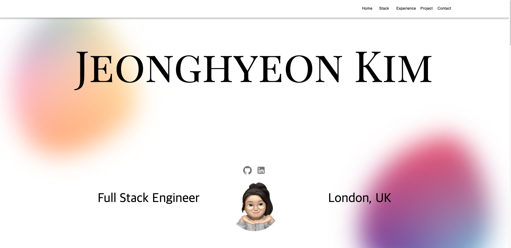

# Jeonghyeon Kim Dev Portfolio 👩🏻‍💻

         

This project is a modern, responsive portfolio website built with React and TypeScript, showcasing an advanced UI/UX design powered by Material-UI. It integrates 3D graphics using Three.js and React-Three-Fiber, and supports dynamic content such as email services through EmailJS. The project is developed and optimized using Vite, ensuring fast build times and an efficient development experience.

This simple portfolio is designed to showcase my past projects, skill sets, career history, and more.

View the [Demo](https://jhkim-dev.netlify.app/).

## Features
✨ **Responsive & mobile-friendly**: Adapts to all screen sizes for a consistent user experience across devices.

✨ **Modular components**: Built with reusable components like ExperienceCard and ProjectCard, allowing for easy customization and scalability.

✨ **Polished UI/UX**: Utilizes Material-UI for a modern, user-friendly interface.

✨ **3D graphics**: Integrates interactive 3D elements using Three.js and React-Three-Fiber.

✨ **Dynamic content**: Supports seamless email communication via EmailJS.

✨ **Fast development**: Optimized with Vite for efficient builds and quick development.

## Authors
[@O-sulloc(Jeonghyeon Kim)](https://github.com/O-sulloc)

This template is open for free use, and no attribution is needed. Customize it by forking or downloading the repository. If you find this portfolio helpful, a ⭐ would mean a lot!